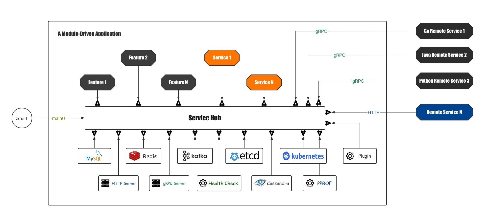

# Erda Infra

[](https://www.apache.org/licenses/LICENSE-2.0.html)
[](https://codecov.io/gh/erda-project/erda-infra)

Translations: [English](README.md) | [简体中文](README_zh.md)

Erda Infra is a lightweight microservices framework implements by golang, which offers many useful modules and tools to help you quickly build a module-driven application.

Many Go projects are built using Erda Infra including:
* [Erda](https://github.com/erda-project/erda)

## Features
* modular design to drive the implementation of the application system, and each module is pluggable.
* each module is configurable, supports setting defaults、reading from files (YAML, HCL,、JSON、TOML、.env file)、environment、flags.
* manage the lifecycle of the module, includes initialization, startup, and shutdown.
* manage dependencies between modules.
* support Dependency Injection between modules.
* offers many commonly modules that can be used directly.
* support define APIs and models in protobuf file to expose both gRPC and HTTP APIs.
* offers tools to help you quickly build a module.
* etc.

## Concept
* Service, represents a function.
* Provider, service provider, equivalent to module, provide some services. It can also depend on other services, witch provide by other provider.
* ProviderDefine, describe a provider, includes provider's name, constructor function of provider, services, etc. Register it by *servicehub.RegisterProvider* function.
* Hub, is a container for all providers, and manage the life cycle of all loaded providers.

A configuration is used to determine whether all registered Providers are loaded, and the Hub initializes, starts, and closes the loaded Providers.



## Define Provider
Define a provider by implementing the *servicehub.ProviderDefine* interface, and register it through the *servicehub.RegisterProvider* function.

But, it is simpler to describe a provider through *servicehub.Spec* and register it through the *servicehub.Register* function.

[Examples](./base/servicehub/examples)

## Quick Start
### Create a Provider
**Step 1**, Create a Provider
```sh
➜ gohub init -o helloworld
Input Service Provider Name: helloworld
➜ tree helloworld
helloworld
├── provider.go
└── provider_test.go
```

**Step 2**, Create *main.go*
```go
package main

import (
	"github.com/erda-project/erda-infra/base/servicehub"
	_ "./helloworld" // your package import path
)

func main() {
	servicehub.Run(&servicehub.RunOptions{
		Content: `
helloworld:
`,
	})
}
```

**Step 3**, Run
```sh
➜ go run main.go
INFO[2021-04-13 13:17:36.416] message: hi                                   module=helloworld
INFO[2021-04-13 13:17:36.416] provider helloworld initialized              
INFO[2021-04-13 13:17:36.416] signals to quit: [hangup interrupt terminated quit] 
INFO[2021-04-13 13:17:36.426] provider helloworld running ...              
INFO[2021-04-13 13:17:39.429] do something...                               module=helloworld
```
[Hello World](./examples/example) \( [helloworld/](./examples/example/helloworld) | [main.go](./examples/example/main.go) \)

### Create HTTP/gRPC Service
These services can be called either remote or local Provider.

**Step 1**, Define the protocol, in the *.proto files, includes Message and Interface.
```protobuf
syntax = "proto3";

package erda.infra.example;
import "google/api/annotations.proto";
option go_package = "github.com/erda-project/erda-infra/examples/service/protocol/pb";

// the greeting service definition.
service GreeterService {
  // say hello
  rpc SayHello (HelloRequest) returns (HelloResponse)  {
    option (google.api.http) = {
      get: "/api/greeter/{name}",
    };
  }
}

message HelloRequest {
  string name = 1;
}

message HelloResponse {
  bool success = 1;
  string data = 2;
}
```

**Step 2**, build protocol to codes 
```sh
➜ gohub protoc protocol *.proto 
➜ tree 
.
├── client
│   ├── client.go
│   └── provider.go
├── greeter.proto
└── pb
    ├── greeter.form.pb.go
    ├── greeter.http.pb.go
    ├── greeter.pb.go
    ├── greeter_grpc.pb.go
    └── register.services.pb.go
```

**Step 3**, implement the interface
```sh
➜ gohub protoc imp *.proto --imp_out=../server/helloworld
➜ tree ../server/helloworld
../server/helloworld
├── greeter.service.go
├── greeter.service_test.go
└── provider.go
```

**Step 4**, Create *main.go* and run it

*main.go*
```
package main

import (
	"os"

	"github.com/erda-project/erda-infra/base/servicehub"

	// import all providers
	_ "github.com/erda-project/erda-infra/examples/service/server/helloworld"
	_ "github.com/erda-project/erda-infra/providers"
)

func main() {
	hub := servicehub.New()
	hub.Run("server", "server.yaml", os.Args...)
}
```

*server.yaml*
```yaml
# optional
http-server:
    addr: ":8080"
grpc-server:
    addr: ":7070"
service-register:
# expose services and interface
erda.infra.example:
```

[Service](./examples/service) \( [Protocol](./examples/service/protocol) | [Implementation](./examples/service/server/helloworld) | [Server](./examples/service/server) | [Caller](./examples/service/caller) | [Client](./examples/service/client)  \)

## Useful Providers
Many available providers have been packaged in this project, it can be found in the [providers/](./providers) directory.

Under each module, there is an examples directory, which contains examples of the use of the module.

* elasticsearch, provide elasticsearch client APIs, and it easy to write batch data.
* etcd, provide etcd client APIs.
* etcd-mutex, distributed lock implemented by etcd.
* grpcserver, start a grpc server.
* grpcclient, provide gRPC client, and manage client's connection.
* health, provide health check API, and can register some health check function into this provider.
* httpserver, provide an HTTP server, support any form of handle function, interceptor, parameter binding, parameter verification, etc.
* i18n, provide internationalization support, manage i18n files, support templates.
* kafka, provide kafka sdk, and easy to produce and consume messages.
* kubernetes, provide kubernetes client APIs.
* mysql, provide mysql client APIs.
* pprof, expose pprof HTTP APIs By httpserver.
* redis, provide redis client APIs.
* zk-master-election, provide interface about master-slave election, it is implemented by zookeeper.
* zookeeper, provide zookeeper client.
* cassandra, provide cassandra APIs, and easy to write batch data
* serviceregister, use it to register services to expose gRPC and HTTP APIs.

# Tools
*gohub* is a CLI tool, which to help you quickly build a Provider. It can be installed as follows:
```sh
go get -u github.com/erda-project/erda-infra/tools/gohub
```

You can also use *gohub* through a Docker container.
```sh
➜ docker run --rm -ti -v $(pwd):/go \
    registry.cn-hangzhou.aliyuncs.com/dice/erda-tools:1.0 gohub                                                                
Usage:
  gohub [flags]
  gohub [command]

Available Commands:
  help        Help about any command
  init        Initialize a provider with name
  pkgpath     Print the absolute path of go package
  protoc      ProtoBuf compiler tools
  tools       Tools
  version     Print the version number

Flags:
  -h, --help   help for gohub

Use "gohub [command] --help" for more information about a command.
```

## License
Erda Infra is under the Apache 2.0 license. See the [LICENSE](/LICENSE) file for details.