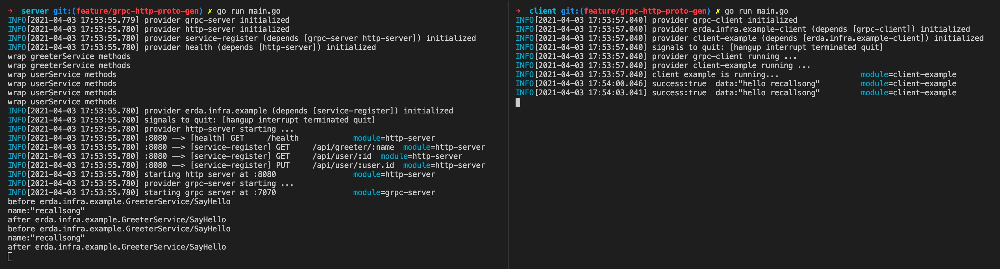

# Erda Infra

[](https://www.apache.org/licenses/LICENSE-2.0.html)
[](https://codecov.io/gh/erda-project/erda-infra)

翻译: [English](README.md) | [简体中文](README_zh.md)

Erda Infra 一套轻量级 Go 微服务框架，包含大量模块化设计相关的工具。

一些 Go 项目基于该框架进行构建:
* [Erda](https://github.com/erda-project/erda)

## 特性
* 模块化设计，支持可插拔
* 统一配置读取，支持默认值、支持从文件、环境变量、命令行参数读取
* 统一模块的初始化、启动、关闭
* 统一管理模块间的依赖关系
* 支持模块间的依赖注入
* 包含大量现成的微模块
* 支持统一 grpc 和 http 接口设计、以及拦截器
* 提供快速构建模块的脚本
* 等等

## 概念 
* Service，服务，表示某个具体的功能
* Provider，服务的提供者，提供0个或多个 Service，也可以依赖0个或多个其他 Service，被依赖的 Service 由其他 Provider 提供
* ProviderDefine，提供 Provider 相关的元信息，比如：提供 Provider 的构造函数。通过 *servicehub.RegisterProvider* 来注册 Provider
* Hub，是所有 Provider 的容器，管理所有已加载的 Provider 的生命周期

所有已注册的 Provider 通过 一份配置来确定是否 加载，由 Hub 对已加载的 Provider 的进行初始化、启动、关闭等。

## Provider 定义
通过实现 *servicehub.ProviderDefine* 接口来定义一个模块，并 通过 *servicehub.RegisterProvider* 函数进行注册。

但更简单的是通过 *servicehub.Spec* 来描述一个模块，并 通过 *servicehub.Register* 函数进行注册。

[例子](./base/servicehub/examples)

## Quick Start

```sh
➜ # create service interface
➜ ROOT_PATH=$(pwd)
➜ ${ROOT_PATH}/tools/protoc.sh protocol examples/protocol/*.proto
➜ 
➜ # create module 
➜ mkdir -p examples/server/helloworld
➜ cd examples/server/helloworld
➜ ${ROOT_PATH}/tools/protoc.sh init "${ROOT_PATH}/examples/protocol/*.proto"
➜ 
➜ # implement the service interface in examples/server/helloworld directory
➜ 
➜ cd ${ROOT_PATH}/examples/server
➜ 
➜ # create main.go, like examples/server/main.go
➜ # create server.yaml, like examples/server/server.yaml
➜ 
➜ go run main.go
```


[Hello World](./examples) \( [Server](./examples/server) | [Client](./examples/client) \)

## 微模块
该项目中已经封装了许多可用的模块，在 [providers/](./providers) 目录下可以找到。

每一个模块下面，都有一个 examples 目录，包含了该模块的使用例子。

* elasticsearch，对 elasticsearch 客户端的封装，更方便的进行批量数据的写入
* etcd，对 etcd 客户端的封装
* etcd-mutex，利用 etcd 实现的分布式锁
* grpcserver，启动一个 grpc server
* grpcclient，统一管理 grpc 客户端
* health，通过 httpserver 注册一个健康检查的接口
* httpserver，提供一个 http server, 支持任意形式的处理函数、拦截器、参数绑定、参数校验等
* i18n，提供了国际化的支持，可以统一管理国际化文件、支持模版
* kafka，提供了访问 kafka 相关的能力，更方便地去批量消费和推送消息
* kubernetes，对 kubernetes 客户端的封装
* mysql，对 mysql 客户端的封装
* pprof，通过 httpserver 注册一些 pprof 相关的接口
* redis，对 redis 客户端的封装
* zk-master-election，通过 zookeeper 实现主从选举
* zookeeper，对 zookeeper 客户端的封装
* serviceregister，封装提供统一注册 grpc 和 http 接口的能力

# 工具
protoc-gen-go-* 系列工具依赖 protobuf 编译器，参考 [protobuf](https://github.com/protocolbuffers/protobuf) 项目进行安装。

也可以通过 Docker 容器来使用以下工具。

```sh
docker run --rm -ti -v $(pwd):/go \
    registry.cn-hangzhou.aliyuncs.com/dice/erda-tools:1.0 protoc.sh usage
```

* protoc-gen-go-grpc，根据 *.proto 文件，提供 grpc server 和 client 支持
* protoc-gen-go-http，根据 *.proto 文件，对定义的 Service 提供 http server 支持
* protoc-gen-go-form，根据 *.proto 文件，对定义的 Message 提供 http form 编解码的支持
* protoc-gen-go-client，根据 *.proto 文件，编译统一的客户端，以及对应的 Provider
* protoc-gen-go-register，方便 Provider 注册 Service 
* protoc-gen-go-provider，根据 *.proto 文件，生成 实现 Service 的 Provider 模版，方便快速开发模块
* protoc.sh，针对 protoc-gen-go-* 系列工具的封装，方便 Service 模块的开发

## License
Erda is under the Apache 2.0 license. See the [LICENSE](/LICENSE) file for details.